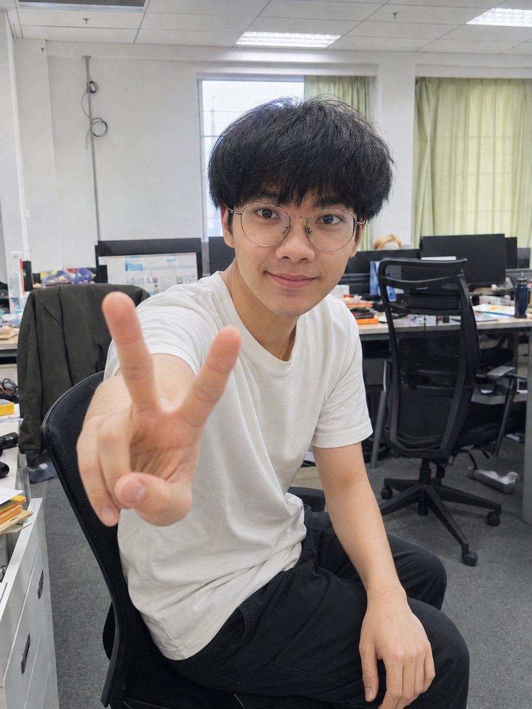

# Hi, I'm Zhiyou Guan 👋

I like building machines that can **perceive, reason, and act**—and then making the whole stack survive outside the lab.

I am an Automation undergraduate at **Northeastern University, China**. My work sits at the intersection of **robotics, embodied intelligence, world models, multimodal agents, and autonomous systems**, with a particular interest in turning research ideas into reliable systems on real hardware.

  
  
  

I am currently preparing applications to **direct-entry Ph.D. programs for 2027 admission**, while continuing to open-source selected research and competition projects.

 

---

## 🛠️ What I Build

- **Robotic systems** — ROS 1 / ROS 2 architecture, motion control, navigation, SLAM, and multi-sensor fusion.
- **World models and multimodal agents** — embodied perception, predictive representations, game agents, reinforcement learning, memory, and evaluation.
- **Autonomous systems** — perception–planning–control pipelines and L3 autonomous-driving system architecture.
- **Deployable AI** — TensorRT, ONNX, INT8 quantization, and edge inference on platforms such as NVIDIA Orin-X and RK3588.

Most of my projects are end-to-end: I care about the model, but also the data flow, interfaces, latency, failure cases, deployment process, and whether the system remains understandable six months later.

---

## 💼 Research & Industry Experience

| Period | Organization | Role & Focus |
| :--- | :--- | :--- |
| **Jan–Jul 2026** | **Tencent Interactive Entertainment Group (IEG)** | **Multimodal Agent Research Intern** — multimodal game agents, reinforcement learning, agent memory, and evaluation. |
| **Jan–May 2025** | **Dongfeng Motor Autonomous Driving & Unmanned Systems Research Institute** | **Autonomous Driving System Architecture Intern** — L3 mass-production architecture, multi-source synchronization, and sensor alignment. |
| **Jul–Oct 2024** | **A*STAR Centre for Frontier AI Research (CFAR), Singapore** | **Research Intern — Robotics Perception** — world models and self-supervised temporal modeling for embodied robotic perception. |

The common thread across these roles is systems thinking: understanding the learning problem, tracing the data path, measuring latency, and making the final system dependable in practice.

---

## 📦 Open Source

> *“Good repositories should not only run. They should be reproducible, readable, and deployable.”*

This profile is an evolving archive of selected research projects and national-level competition systems. My goal is to document not only the final code, but also the architecture, experiments, deployment process, engineering decisions, and practical limitations.

| Area | What You Will Find |
| :--- | :--- |
| **Robotics** | Full-stack robotic systems, ROS architecture, motion control, and deployment notes |
| **Perception & SLAM** | LiDAR / IMU / vision fusion, mapping, localization, and 3D perception |
| **World Models** | Embodied perception, predictive scene modeling, and robot–environment interaction |
| **Multimodal Agents** | Game agents, multimodal reasoning, reinforcement learning, memory, and evaluation |
| **AI Deployment** | Model compression, TensorRT deployment, ONNX export, and edge inference |
| **Autonomous Driving** | Perception, planning, control, and L3 system architecture |
| **Competition Systems** | Selected national-level winning projects and engineering records |

---

## Selected Highlights

**A few concrete signals:** National Scholarship · Top **0.45%** · Cambridge University AI Exchange, Grade A · Two first-author SCI journal manuscripts currently under review · **38 registered software copyrights**.

I have also been invited to give technical talks on AI robotics at **DJI** and other technology companies, and my projects have been featured by **China.com Media Client**, **China Daily Tech**, and other media outlets.

<strong>Selected competition results</strong>

 

| Award | Competition / Track | Role |
| :--- | :--- | :---: |
| **National Champion** | China Robotics & AI Competition | **Captain** |
| **National Gold Award** | “Internet+” Innovation & Entrepreneurship Competition | **Software Lead** |
| **National First Prize** | “Challenge Cup” Academic & Technology Competition | **Algorithm Lead** |
| **National Runner-up** | NXP Smart Car Competition, Outdoor Unmanned Track | **Captain** |
| **National Third Place** | NXP Smart Car Competition, Smart Delivery Track | **Captain** |
| **National First Prize** | Global Campus AI Algorithm Elite Competition, New Engineering Track | **Captain** |

---

## 🧰 Tools I Reach For

**Languages & Core**  
 

  

**AI & Acceleration**  
 

  

  

**Robotics & Autonomous Systems**  
 

  

---

## 📈 Open-Source Activity

  
  
  

Repositories are being organized and released progressively. Documentation, reproducibility, and real deployment details take priority over publishing unfinished code quickly.

---

## 🤝 Let's Talk

If you are working on robotics, embodied AI, world models, multimodal agents, or deployable autonomous systems, I am always happy to compare notes, discuss research ideas, or collaborate on open-source work.

📮 **Email:** [202310169@stu.neuq.edu.cn](mailto:202310169@stu.neuq.edu.cn)
